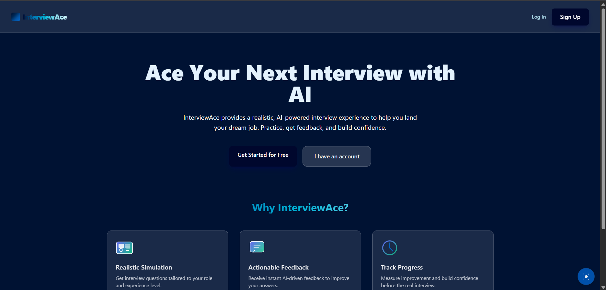
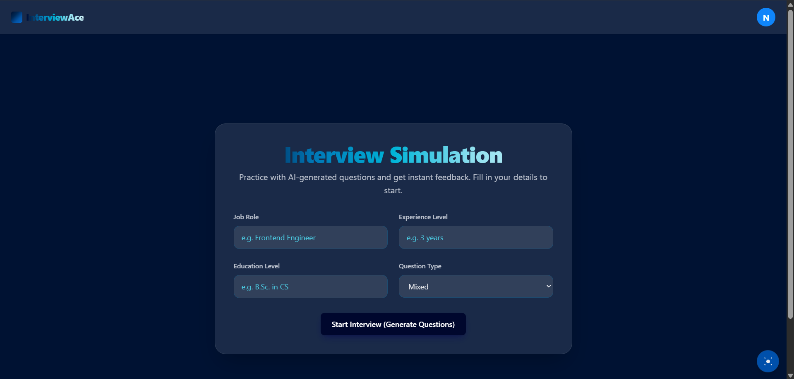

# InterviewAce - Frontend

**Deployed URL:** [https://interview-ace-fe.vercel.app](https://interview-ace-fe.vercel.app/)

## Project Description
InterviewAce is a **Full Stack Web Application** designed to assist candidates in preparing for interviews through an AI-powered simulation. Built with the **MERN stack (MongoDB, Express.js, React, Node.js)** and **TypeScript**, this application embodies RAD principles—rapid prototyping, iterative enhancement, and user-centred design.

The frontend is a responsive, modern single-page application (SPA) that provides a seamless user experience for registration, authentication, and interactive mock interviews generated by AI.

## Technologies and Tools Used
- **Core:** React (Functional Components + Hooks), TypeScript
- **Build Tool:** Vite
- **Styling:** TailwindCSS (Responsive Design, Dark Mode support)
- **State Management:** Context API (Auth & Theme)
- **Routing:** React Router v7
- **HTTP Client:** Axios (Interceptors for JWT handling)
- **UI Components:** Lucide React (Icons), SweetAlert2 (Alerts & Toasts)
- **Deployment:** Vercel

## Main Features
1.  **User Authentication & Security**:
    -   Secure Registration and Login with JWT handling.
    -   Password Reset flow with OTP verification.
    -   SweetAlert2 integrated for enhanced user feedback (success/error popups).
2.  **AI Interview Simulator** (Advanced Feature):
    -   Generates interview questions dynamically using the **Gemini AI API** (via backend).
    -   Text-to-Speech (TTS) to read questions aloud.
    -   Speech-to-Text (STT) for capturing user answers (Web Speech API).
3.  **Community & Posts**:
    -   View and interact with interview experiences shared by other users.
    -   Pagination and skeleton loading states for better UX.
4.  **Responsive UI/UX**:
    -   Fully responsive layout using TailwindCSS.
    -   Dark/Light mode toggle.
    -   Glassmorphism effects and animated gradients.

## Setup and Run Instructions

### 1. Prerequisites
-   Node.js (v18 or higher recommended)
-   npm

### 2. Installation
```powershell
# Clone the repository
git clone <repository_url>

# Navigate to the frontend directory
cd interviewace_fe

# Install dependencies
npm install
```

### 3. Environment Setup
Create a `.env` file in the root directory if needed (though `VITE_API_BRE_URL` might be hardcoded in `src/services/api.ts` or set via `VITE_` variables):
```
VITE_API_URL=http://localhost:5000/api/v1
```

### 4. Run Locally
```powershell
npm run dev
```
The app will be available at `http://localhost:5173`.

### 5. Build for Production
```powershell
npm run build
```

## Screenshots
Landing Page

Interview Page

---
*Submitted as part of the Full Stack Web Application Development Coursework.*

